# Spring Cloud Microservices - Customers, Inventory, Gateway & Eureka

Ce projet présente une architecture microservices basée sur **Spring Boot** et **Spring Cloud**, incluant :

- Un **Customer Service** exposé avec Spring Data REST
- Un **Inventory/Product Service**
- Un **Eureka Discovery Service** pour la découverte des services
- Un **Spring Cloud Gateway** jouant le rôle d’API Gateway
- L’utilisation de **Spring Data REST**, **projections**, **Actuator**, **routage statique et dynamique** via le Gateway

L’objectif est de montrer comment construire une architecture claire, documentée par des captures d’écran numérotées.

---

## 🏗️ Architecture globale

Ce projet suit le schéma classique :

**Client → Spring Cloud Gateway → (Customer Service / Inventory Service) + Eureka Discovery**

---

## 🖼️ Captures d’écran (numérotées dans l’ordre)

### 1️⃣ Vérification du Customer Service dans H2

**(1) Vérifier les données `Customer` dans H2.**  
Permet de confirmer que les clients sont bien persistés en base.

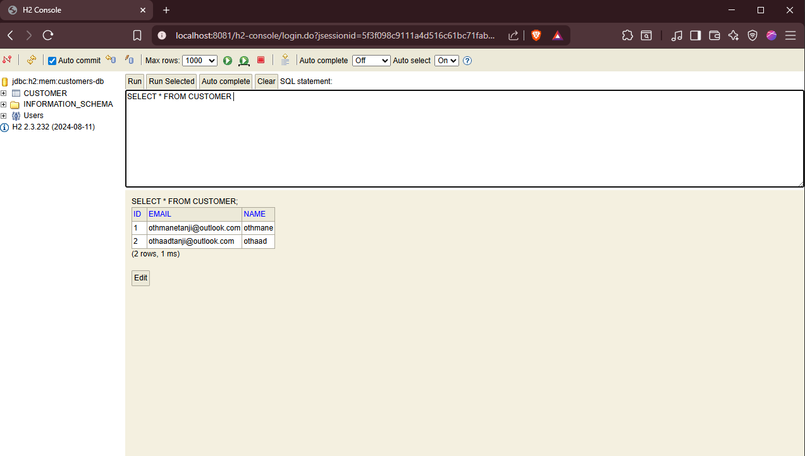

---

### 2️⃣ Exposition automatique via Spring Data REST

**(2) Vérifier que `CustomerService` expose les ressources via Spring Data REST.**  
Spring Data REST joue le rôle de contrôleur REST automatique.

-3.PNG)

---

### 3️⃣ Exposer l’ID côté Spring Data REST (Code)

**(3) Configuration pour exposer les IDs dans les réponses JSON.**

-car-pardefaut-la-serialization-le-cache-(code)4.PNG)

---

### 4️⃣ Exposer l’ID côté Spring Data REST (Résultat)

**(4) Résultat : les IDs sont maintenant visibles dans la réponse JSON.**

-car-pardefaut-la-serialization-le-cache-4.PNG)

---

### 5️⃣ Personnalisation du chemin Spring Data REST

**(5) Personnaliser le path d’accès (ex: `/api/customers`) au lieu des URLs par défaut.**

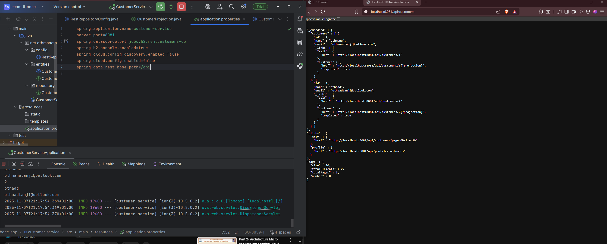

---

### 6️⃣ Projection Spring Data REST (Code)

**(6) Mise en place d’une projection pour contrôler les champs retournés (style GraphQL).**

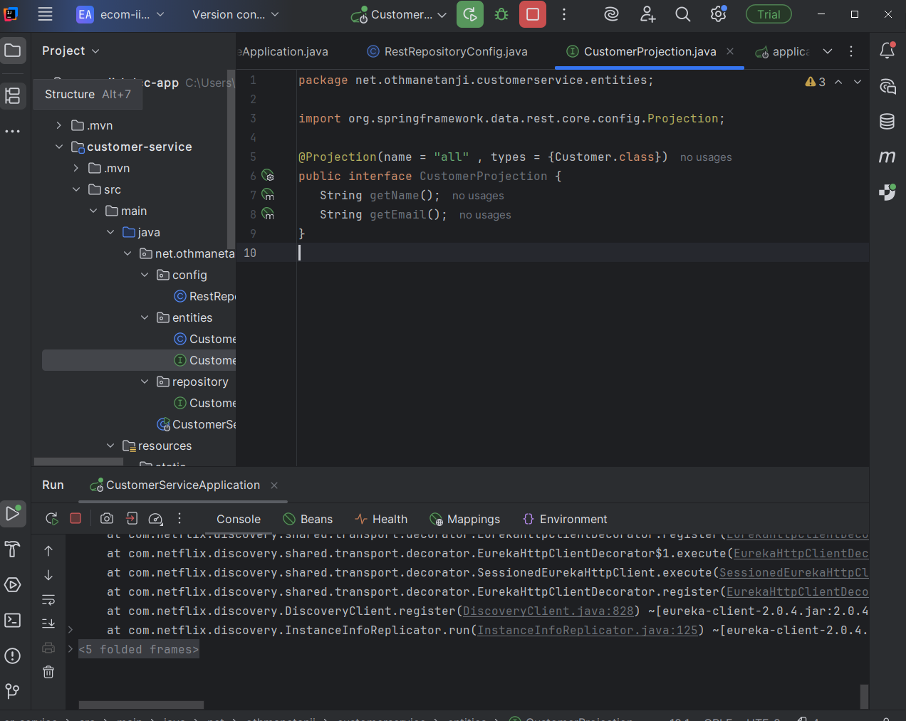

---

### 7️⃣ Projection Spring Data REST (Résultat)

**(7) Résultat de la projection : seules les propriétés souhaitées sont renvoyées.**

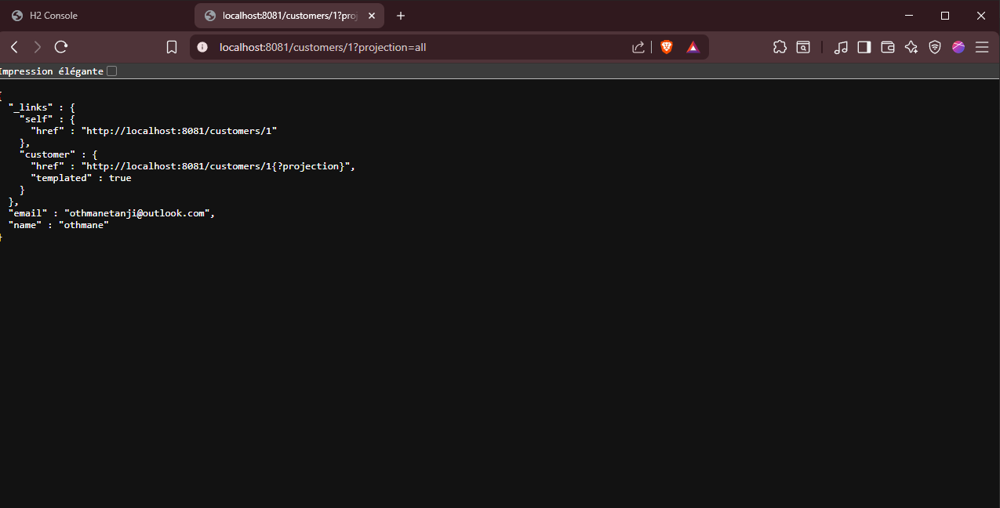

---

### 8️⃣ Vérifier le statut du Customer Service avec Actuator (Health)

**(8) Utilisation de `/actuator/health` pour vérifier que le service est bien démarré.**

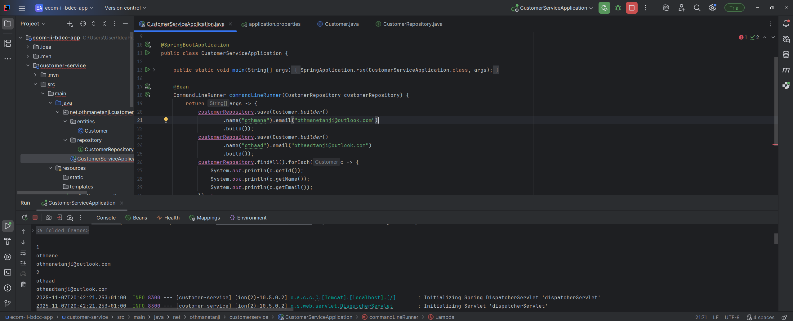

---

### 9️⃣ Vérifier qu’un service est bien démarré

**(9) Vérification supplémentaire de l’état d’un service avant intégration avec les autres composants.**

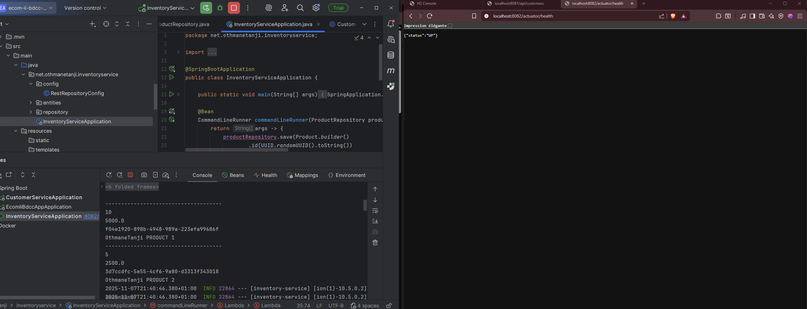

---

### 🔟 Création des microservices & préparation du Gateway

**(10) Création des services (Customer, Inventory sur port 8082, etc.) et préparation de la configuration Gateway.**

---

### 1️⃣1️⃣ Configuration statique de la Gateway (YAML)

**(11) Configuration des routes statiques dans Spring Cloud Gateway pour router vers les microservices.**

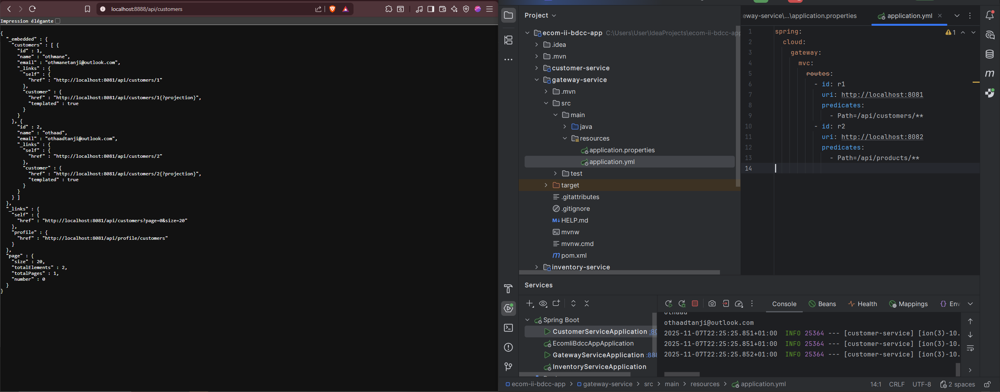

---

### 1️⃣2️⃣ Schéma du routage statique Gateway

**(12) Schéma expliquant le routage statique à travers le Gateway.**

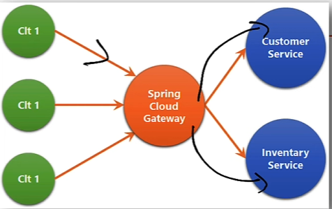

---

### 1️⃣3️⃣ Intégration avec Eureka (Découverte de services)

**(13) Intégration du Discovery Service pour que les microservices s’enregistrent automatiquement sans connaître les adresses exactes des autres.**

---

### 1️⃣4️⃣ Dashboard Eureka

**(14) Vue du tableau de bord Eureka montrant les services enregistrés.**

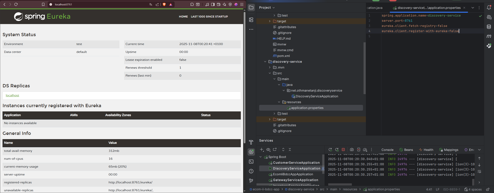

---

### 1️⃣5️⃣ Tous les services enregistrés dans Eureka

**(15) Confirmation que les trois services sont bien enregistrés dans Eureka.**

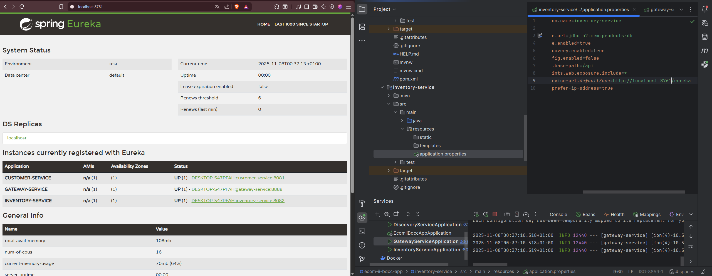

---

### 1️⃣6️⃣ Accès au microservice via la Gateway

**(16) Démonstration : appel du `CustomerService` via la Gateway au lieu d’appeler directement le microservice.**

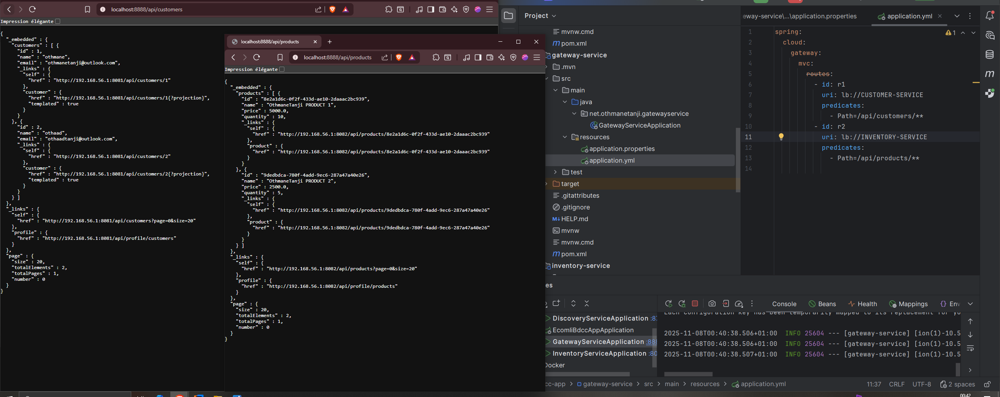

---

### 1️⃣7️⃣ Routage dynamique avec Eureka + Gateway

**(17) Utilisation du routage dynamique (`lb://SERVICE-NAME`) basé sur les noms des services enregistrés dans Eureka.**

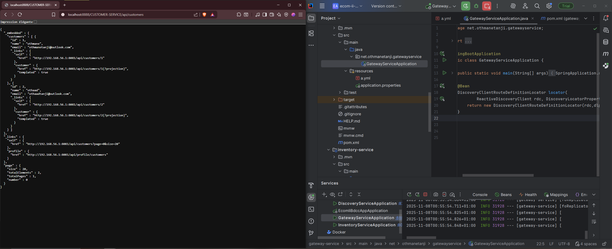

---

### 1️⃣8️⃣ Architecture Gateway / Microservices

**(18) Schéma global de l’architecture Spring Cloud Gateway + microservices + Eureka.**

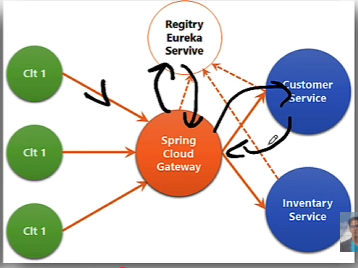

---

### 1️⃣9️⃣ Actuator - Beans et infos techniques

**(19) Visualisation des informations exposées par Actuator (beans, context, etc.) pour le monitoring.**

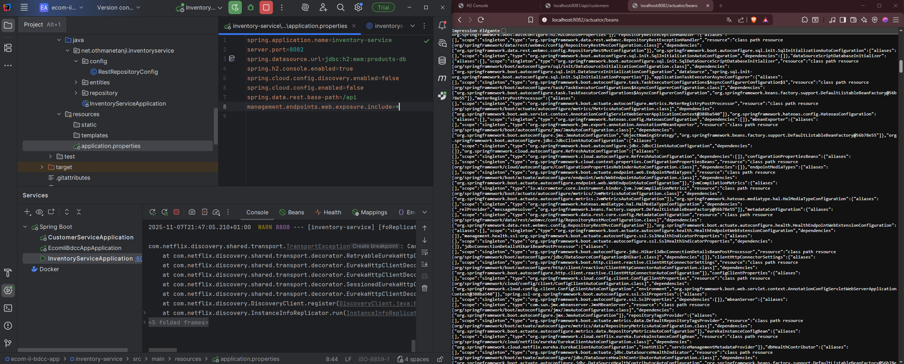

---

## 🚀 Lancement du projet

1. Démarrer **Eureka Discovery Service**
2. Démarrer **Customer Service**
3. Démarrer **Inventory/Product Service**
4. Démarrer **Spring Cloud Gateway**
5. Tester :
   - `http://localhost:<gateway-port>/api/customers`
   - `http://localhost:<gateway-port>/api/products`
   - `http://localhost:<eureka-port>/` pour le dashboard Eureka

---

## 🛠️ Stack technique

- Java & Spring Boot
- Spring Data JPA & Spring Data REST
- Spring Cloud Gateway (statique & dynamique)
- Spring Cloud Netflix Eureka
- Spring Boot Actuator
- H2 Database

