# Spring Cloud Microservices - Customers, Inventory, Gateway & Eureka

Ce projet présente une architecture microservices basée sur **Spring Boot** et **Spring Cloud**, incluant :

- Un **Customer Service** exposé avec Spring Data REST
- Un **Inventory/Product Service**
- Un **Eureka Discovery Service** pour la découverte des services
- Un **Spring Cloud Gateway** jouant le rôle d’API Gateway
- L’utilisation de **Spring Data REST**, **projections**, **Actuator**, **routage statique et dynamique** via le Gateway

L’objectif est de montrer comment construire une architecture claire, documentée par des captures d’écran numérotées.

---

## 🏗️ Architecture globale

Ce projet suit le schéma classique :

**Client → Spring Cloud Gateway → (Customer Service / Inventory Service) + Eureka Discovery**

---

## 🖼️ Captures d’écran (numérotées dans l’ordre)

### 1️⃣ Vérification du Customer Service dans H2

**(1) Vérifier les données `Customer` dans H2.**  
Permet de confirmer que les clients sont bien persistés en base.

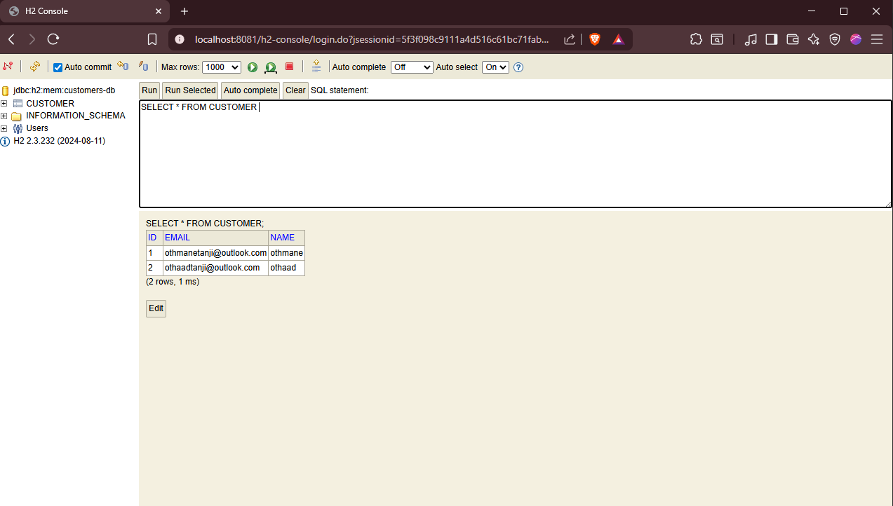

---

### 2️⃣ Exposition automatique via Spring Data REST

**(2) Vérifier que `CustomerService` expose les ressources via Spring Data REST.**  
Spring Data REST joue le rôle de contrôleur REST automatique.

-3.PNG)

---

### 3️⃣ Exposer l’ID côté Spring Data REST (Code)

**(3) Configuration pour exposer les IDs dans les réponses JSON.**

-car-pardefaut-la-serialization-le-cache-(code)4.PNG)

---

### 4️⃣ Exposer l’ID côté Spring Data REST (Résultat)

**(4) Résultat : les IDs sont maintenant visibles dans la réponse JSON.**

-car-pardefaut-la-serialization-le-cache-4.PNG)

---

### 5️⃣ Personnalisation du chemin Spring Data REST

**(5) Personnaliser le path d’accès (ex: `/api/customers`) au lieu des URLs par défaut.**

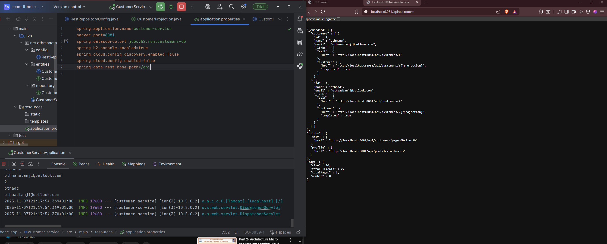

---

### 6️⃣ Projection Spring Data REST (Code)

**(6) Mise en place d’une projection pour contrôler les champs retournés (style GraphQL).**

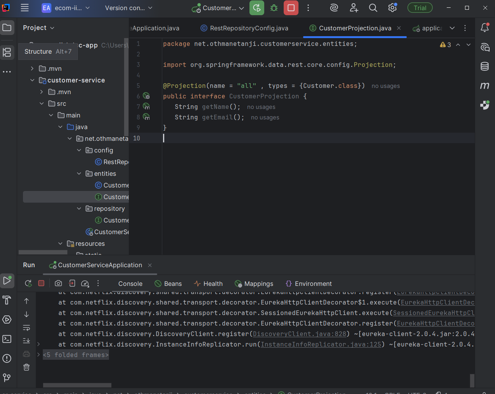

---

### 7️⃣ Projection Spring Data REST (Résultat)

**(7) Résultat de la projection : seules les propriétés souhaitées sont renvoyées.**

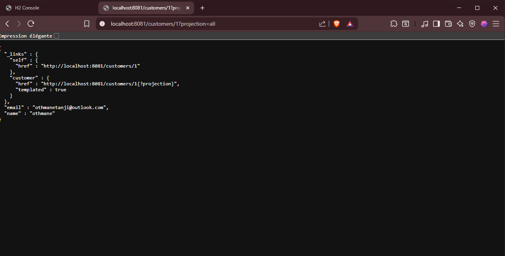

---

### 8️⃣ Vérifier le statut du Customer Service avec Actuator (Health)

**(8) Utilisation de `/actuator/health` pour vérifier que le service est bien démarré.**

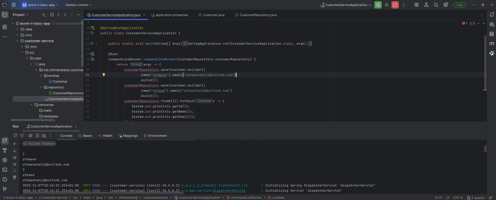

---

### 9️⃣ Vérifier qu’un service est bien démarré

**(9) Vérification supplémentaire de l’état d’un service avant intégration avec les autres composants.**

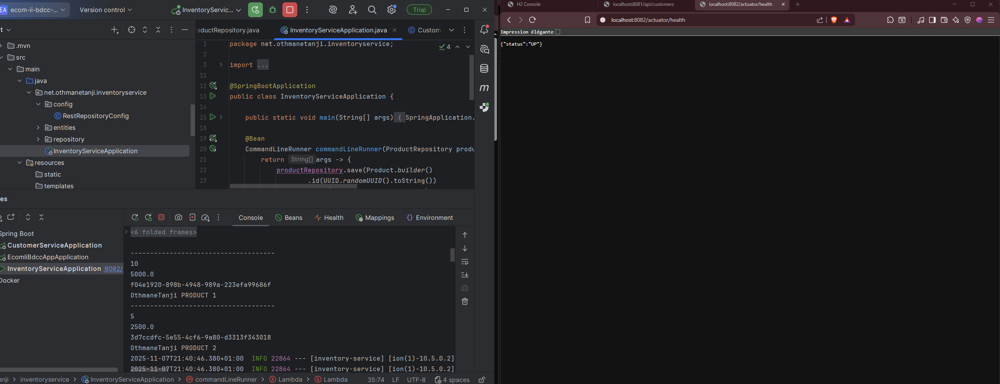

---

### 🔟 Création des microservices & préparation du Gateway

**(10) Création des services (Customer, Inventory sur port 8082, etc.) et préparation de la configuration Gateway.**

---

### 1️⃣1️⃣ Configuration statique de la Gateway (YAML)

**(11) Configuration des routes statiques dans Spring Cloud Gateway pour router vers les microservices.**

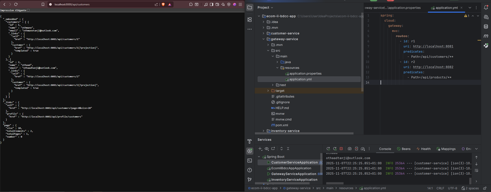

---

### 1️⃣2️⃣ Schéma du routage statique Gateway

**(12) Schéma expliquant le routage statique à travers le Gateway.**

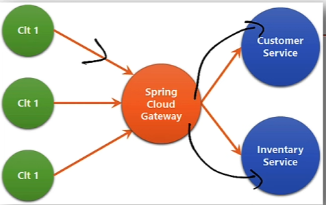

---

### 1️⃣3️⃣ Intégration avec Eureka (Découverte de services)

**(13) Intégration du Discovery Service pour que les microservices s’enregistrent automatiquement sans connaître les adresses exactes des autres.**

---

### 1️⃣4️⃣ Dashboard Eureka

**(14) Vue du tableau de bord Eureka montrant les services enregistrés.**

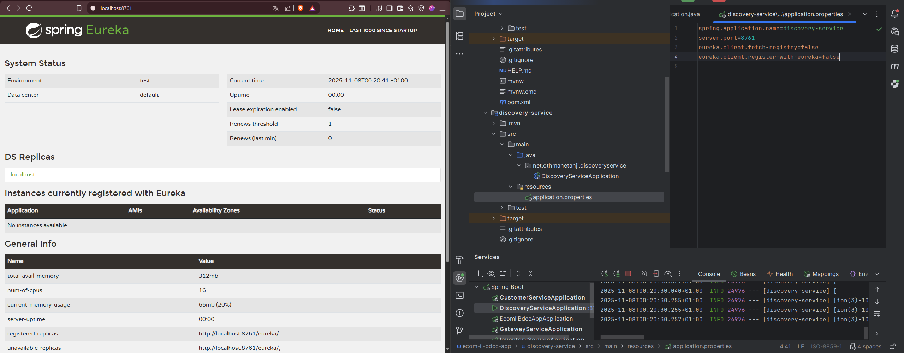

---

### 1️⃣5️⃣ Tous les services enregistrés dans Eureka

**(15) Confirmation que les trois services sont bien enregistrés dans Eureka.**

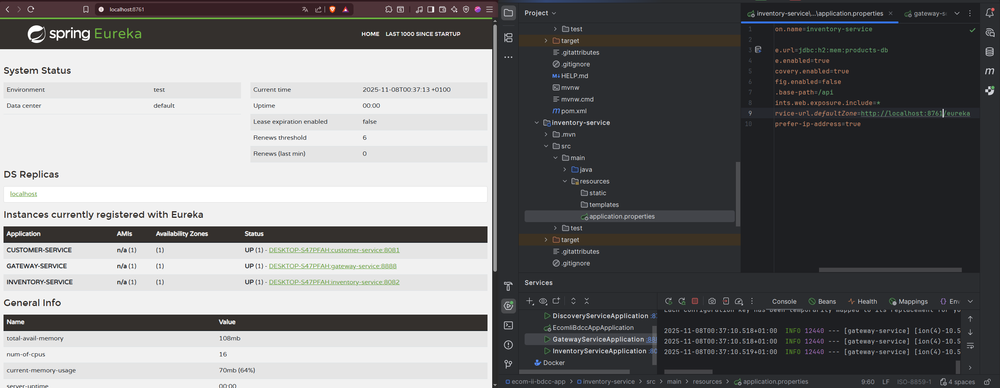

---

### 1️⃣6️⃣ Accès au microservice via la Gateway

**(16) Démonstration : appel du `CustomerService` via la Gateway au lieu d’appeler directement le microservice.**

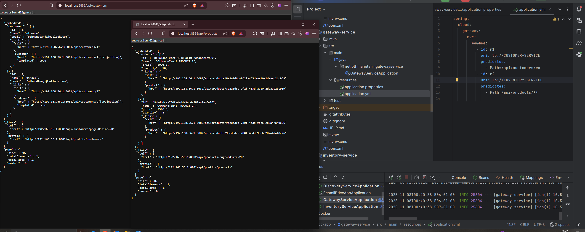

---

### 1️⃣7️⃣ Routage dynamique avec Eureka + Gateway

**(17) Utilisation du routage dynamique (`lb://SERVICE-NAME`) basé sur les noms des services enregistrés dans Eureka.**

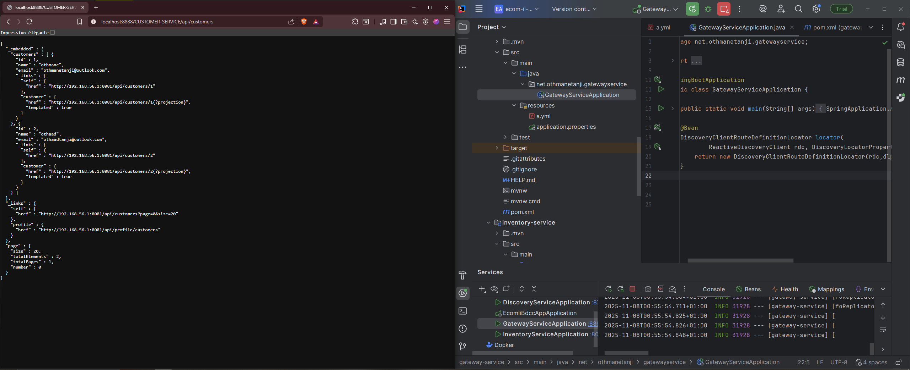

---

### 1️⃣8️⃣ Architecture Gateway / Microservices

**(18) Schéma global de l’architecture Spring Cloud Gateway + microservices + Eureka.**

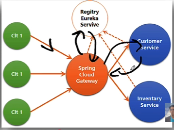

---

### 1️⃣9️⃣ Actuator - Beans et infos techniques

**(19) Visualisation des informations exposées par Actuator (beans, context, etc.) pour le monitoring.**

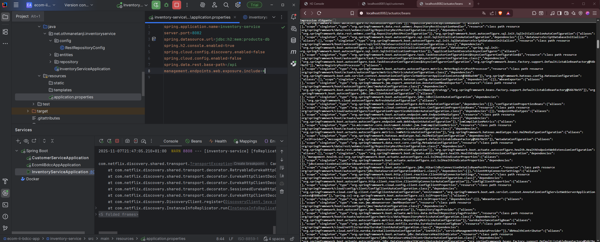

---

## 2️⃣0️⃣ Configuration du Spring Cloud Config Server

**(20) Création du config-service, configuration du port 9999 et initialisation du repo Git config-repo contenant les fichiers de configuration utilisés par les microservices.**

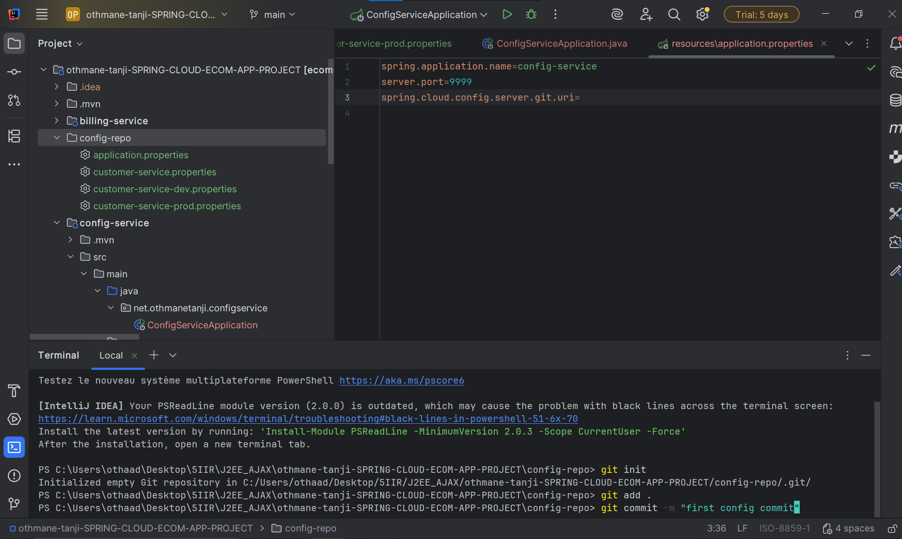

---

## 2️⃣1️⃣ Config Server – Activation avec @EnableConfigServer

**(21) Activation du serveur de configuration Spring Cloud grâce à l’annotation @EnableConfigServer dans la classe ConfigServiceApplication, après l’initialisation du dépôt Git contenant les fichiers de configuration.**

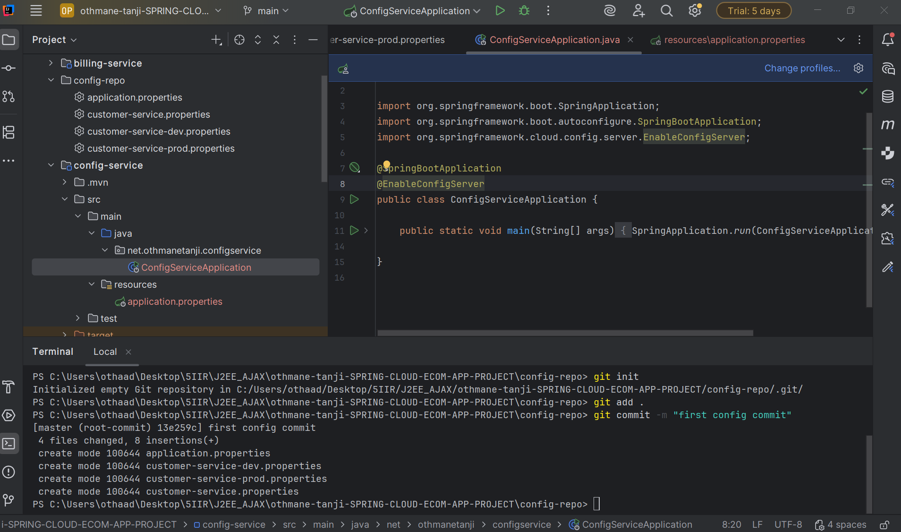

---

## 2️⃣2️⃣ Définition du chemin Git pour le Config Server

**(22) Configuration du spring.cloud.config.server.git.uri avec le chemin complet du dossier config-repo, récupéré via la commande pwd, afin que le Config Server puisse charger les fichiers de configuration.**

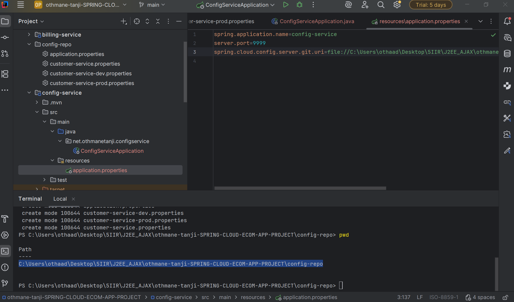

---

## 2️⃣3️⃣ Test du Config Server – Chargement de la configuration d’un microservice

**(23) Vérification du fonctionnement du Config Server via l’URL http://localhost:9999/customer-service/default, montrant le JSON généré contenant les propriétés chargées depuis le repo Git (customer-service.properties et application.properties).**

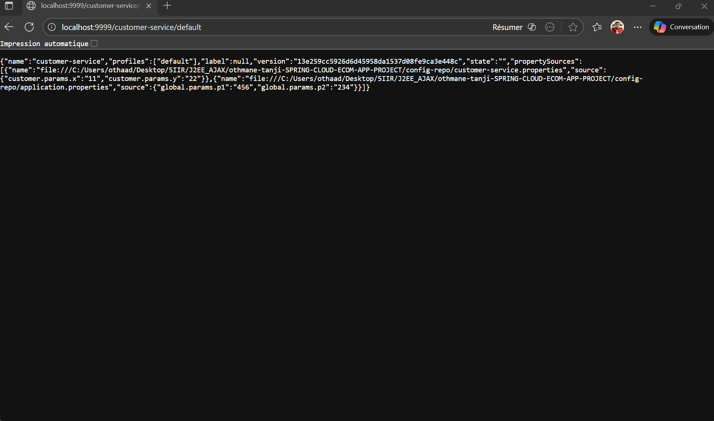

---

## 2️⃣4️⃣ Injection des paramètres du Config Server dans un microservice

**(24) Test de l’injection des propriétés distantes (global.params.p1, global.params.p2) depuis le Config Server dans le microservice customer-service, avec exposition via l’endpoint /testConfig1. Le JSON retourné ({"p1":"456","p2":"234"}) confirme que la configuration est correctement chargée.**

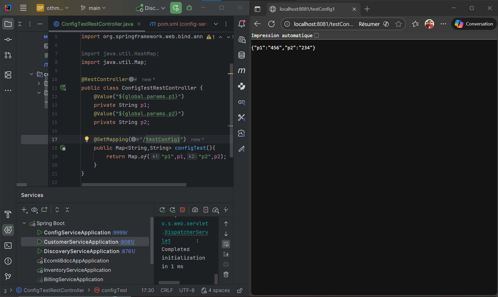

---

## 2️⃣5️⃣ Modification des paramètres globaux (sans rafraîchissement automatique)

**(25) Mise à jour des valeurs global.params.p1 et global.params.p2 dans application.properties du config-repo (777 et 8989).**
**Cependant, le microservice customer-service affiche toujours les anciennes valeurs (456, 234) car aucun mécanisme de rafraîchissement** **(/actuator/refresh, Spring Cloud Bus, ou redémarrage manuel) n’a encore été déclenché.**

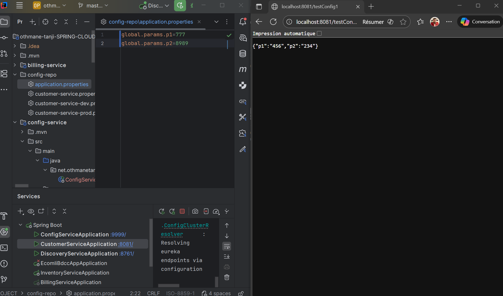

---

## 2️⃣6️⃣ Rafraîchissement manuel de la configuration avec /actuator/refresh

**(26) Envoi d’une requête POST vers http://localhost:8081/actuator/refresh afin de recharger dynamiquement les nouvelles valeurs du config-repo sans redémarrer le microservice. La réponse 200 OK confirme que les propriétés ont été actualisées côté client.**

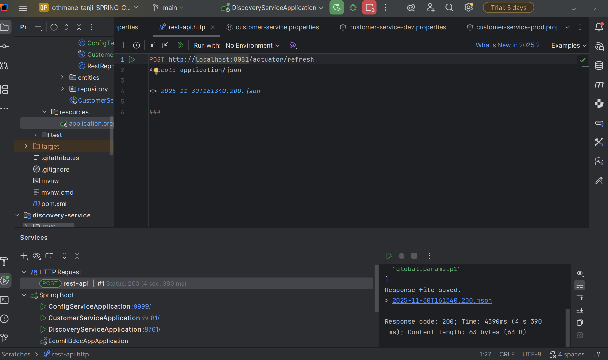

---

## 2️⃣7️⃣ Vérification des microservices enregistrés dans Eureka

(27) Consultation du tableau de bord Eureka (http://localhost:8761) pour vérifier que tous les microservices sont correctement enregistrés :

BILLING-SERVICE

CONFIG-SERVICE

CUSTOMER-SERVICE

GATEWAY-SERVICE

INVENTORY-SERVICE

Tous apparaissent avec le statut UP et leurs URLs respectives, confirmant une intégration réussie avec le Discovery Server.

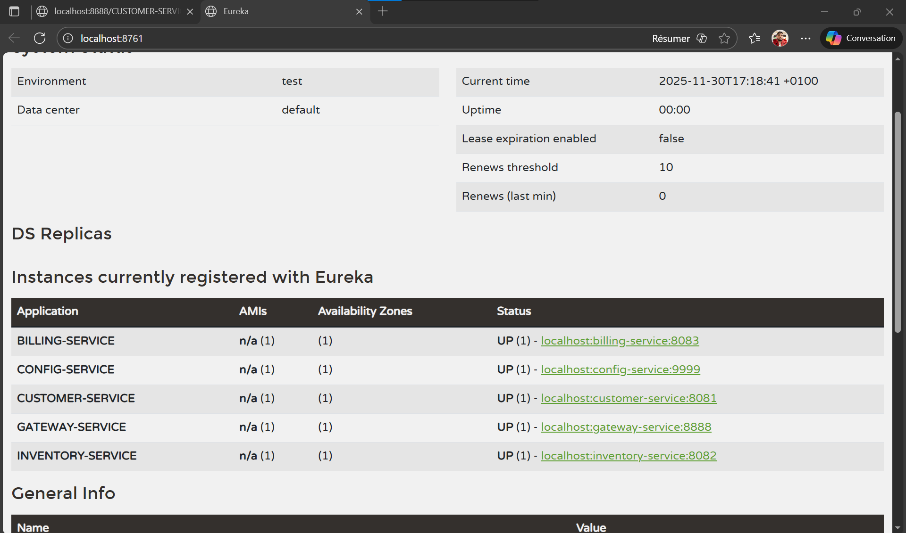

---

## 2️⃣8️⃣ Vérification du routage via le Gateway

**(28) Appel de l’endpoint /testConfig1 du microservice customer-service en passant par l’API Gateway (http://localhost:8888/CUSTOMER-SERVICE/testConfig1).
Les valeurs retournées ({"p1":"1111","p2":"2222"}) confirment que :

le routage dynamique lb://CUSTOMER-SERVICE fonctionne,

la configuration a bien été rafraîchie après le /actuator/refresh,

la communication Gateway → Eureka → Customer-Service est correcte. **

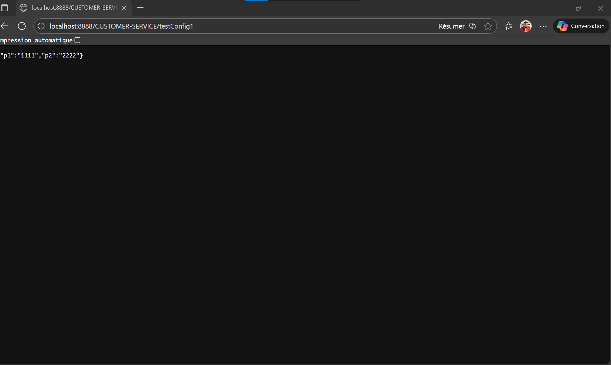

2️⃣9️⃣ Appel d’un microservice complet via le Gateway – Facture détaillée

(30) Test du routage complet via Gateway avec l’endpoint :
http://localhost:8888/BILLING-SERVICE/bills/1

La réponse JSON retournée contient :

les informations de la facture (billingDate, customerId, …)

les productItems enrichis automatiquement par le Inventory Service,

les informations du Customer Service récupérées via communication inter-services,

le tout accessible via Gateway grâce au routage dynamique Eureka + Gateway.

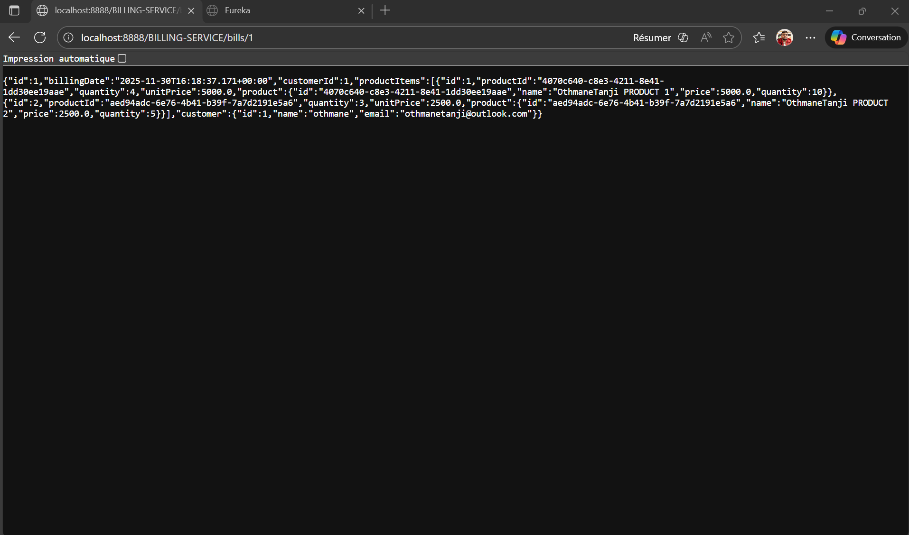

3️⃣0️⃣ Architecture globale — Communication entre Config Server, Eureka, Gateway et microservices

(29) Schéma d’ensemble montrant l’architecture microservices complète :

(1) Les microservices (Customer, Billing, Inventory) se registrent automatiquement auprès du Eureka Discovery Server.

(2) Le Config Service fournit les configurations centralisées à tous les microservices.

(3) Le Spring Cloud Gateway récupère la liste des instances via Eureka et redirrige les clients vers les bons services grâce au routage dynamique.

**(4) Eureka agit comme un registre des services disponibles.

**(5) Les microservices communiquent entre eux via Eureka, sans connaître leurs adresses réelles.

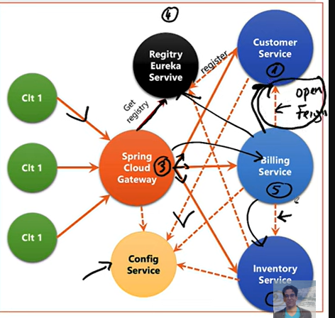

## 3️⃣1️⃣ Intégration du Frontend Angular avec les microservices via le Gateway

(31) Le frontend Angular (port 4200) consomme l’API INVENTORY-SERVICE via le Gateway (http://localhost:8888/INVENTORY-SERVICE/products) et affiche correctement la liste des produits.
Cela confirme :

le bon fonctionnement du CORS,

la communication Angular → Gateway → Eureka → Inventory Service,

le mapping du tableau Angular avec les données réelles du microservice.

## 3️⃣2️⃣ Frontend Angular – Affichage des clients via le Customer Service

(32) Le frontend Angular (port 4200) consomme l’API du CUSTOMER-SERVICE via le Gateway (http://localhost:8888/CUSTOMER-SERVICE/customers) et affiche la liste des clients.
Ce résultat confirme que :

le routage dynamique via Gateway fonctionne,

le service Eureka fournit correctement l’adresse du microservice,

le frontend récupère et mappe les données du backend sans erreur,

CORS et HTTPClient Angular sont correctement configurés.

## 🚀 Lancement du projet

1. Démarrer **Eureka Discovery Service**
2. Démarrer **Customer Service**
3. Démarrer **Inventory/Product Service**
4. Démarrer **Spring Cloud Gateway**
5. Tester :
   - `http://localhost:<gateway-port>/api/customers`
   - `http://localhost:<gateway-port>/api/products`
   - `http://localhost:<eureka-port>/` pour le dashboard Eureka

---

## 🛠️ Stack technique

- Java & Spring Boot
- Spring Data JPA & Spring Data REST
- Spring Cloud Gateway (statique & dynamique)
- Spring Cloud Netflix Eureka
- Spring Boot Actuator
- H2 Database

